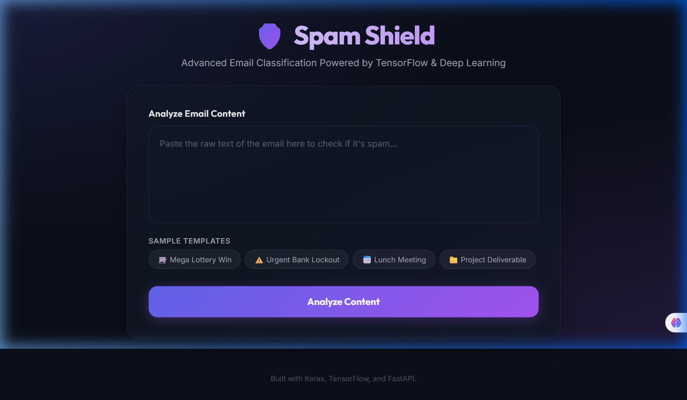
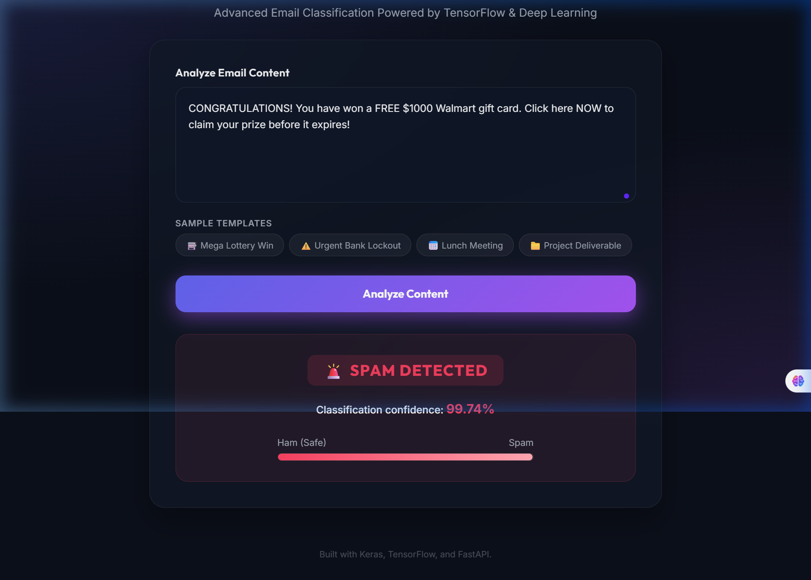
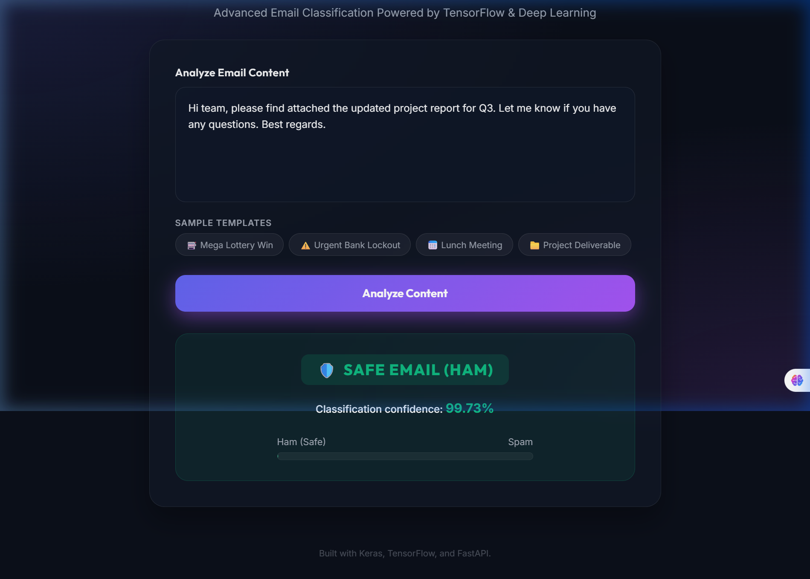
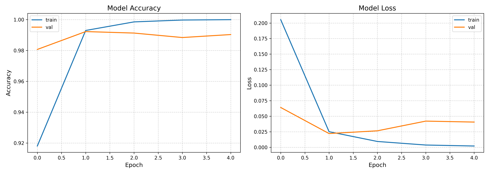
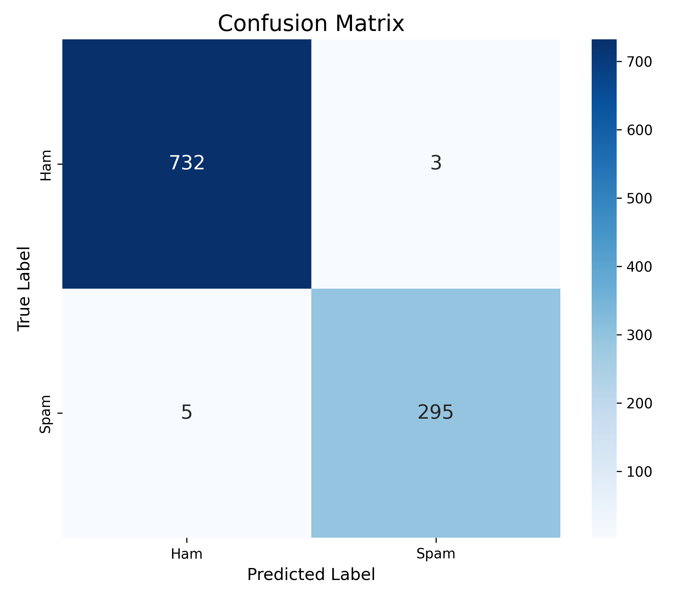

# 📧 Detecting Spam Emails Using TensorFlow

A production-ready deep learning pipeline that classifies emails as **Spam** or **Ham (Legitimate)** using a Bidirectional LSTM neural network built with TensorFlow & Keras.

> **Accuracy: 99.23%** | **F1-Score: 99.0%** | **Dataset: 5,172 emails**

---

## 🖥️ Web App UI

### Homepage — Email Input Interface


### 🚨 Spam Detected Result


### ✅ Safe Email (Ham) Result


---

## 🔁 How It Works

```
  ┌─────────────────────────────────────────────────────────────┐
  │                    HOW SPAM SHIELD WORKS                    │
  └─────────────────────────────────────────────────────────────┘

  1. USER INPUTS EMAIL TEXT
        │
        ▼
  2. TEXT CLEANING  (src/preprocess.py)
     • Remove "Subject:" prefix
     • Strip newlines, tabs, extra spaces
        │
        ▼
  3. TEXT VECTORIZATION  (built into model)
     • Convert words → integer token IDs
     • Pad / truncate to 150 tokens
        │
        ▼
  4. EMBEDDING LAYER
     • Map each token → 64-dim dense vector
        │
        ▼
  5. BIDIRECTIONAL LSTM
     • Read sequence forward + backward
     • Capture long-range word dependencies
        │
        ▼
  6. DENSE + DROPOUT LAYERS
     • Learn high-level spam patterns
     • Prevent overfitting with 30% dropout
        │
        ▼
  7. SIGMOID OUTPUT
     • Outputs probability: 0.0 (Ham) → 1.0 (Spam)
     • Threshold: > 0.5 = SPAM, ≤ 0.5 = HAM
        │
        ▼
  8. RESULT DISPLAYED
     🚨 SPAM DETECTED  (e.g. 99.74% confidence)
     🛡️ SAFE EMAIL     (e.g. 99.73% confidence)
```

### Step-by-Step User Flow
| Step | Action | Description |
|:----:|:-------|:------------|
| 1 | Open the web app | Go to `http://localhost:8000` |
| 2 | Paste or type email text | Use the large text area input |
| 3 | (Optional) Use sample templates | Click "Mega Lottery Win", "Lunch Meeting", etc. |
| 4 | Click **"Analyze Content"** | Sends the email to the AI model |
| 5 | View result | Instantly see SPAM or HAM with confidence % |

---

## 📊 Model Performance

### Training History (Accuracy & Loss)


### Confusion Matrix


### Classification Report

| Class | Precision | Recall | F1-Score | Support |
|:------|:---------:|:------:|:--------:|:-------:|
| Ham (Legit) | 0.99 | 1.00 | **0.99** | 735 |
| Spam | 0.99 | 0.98 | **0.99** | 300 |
| **Overall Accuracy** | | | **99.23%** | **1035** |

---

## 🏗️ Project Structure

```
Detecting Spam Emails Using Tensorflow/
├── Dockerfile                        # Docker deployment
├── README.md                         # Project documentation
├── requirements.txt                  # Python dependencies
├── spam_ham_dataset.csv              # Email dataset (5,172 rows)
├── outputs/
│   ├── spam_classifier_model.keras   # Trained TensorFlow model
│   ├── training_history.png          # Accuracy & loss curves
│   ├── confusion_matrix.png          # Evaluation heatmap
│   └── screenshots/                  # Web UI screenshots
│       ├── ui_home.png
│       ├── ui_spam_result.png
│       └── ui_ham_result.png
├── src/
│   ├── app.py                        # FastAPI server
│   ├── config.py                     # Hyperparameters & paths
│   ├── models.py                     # BiLSTM, Conv1D, Dense models
│   ├── predict.py                    # Inference CLI
│   ├── preprocess.py                 # Text cleaning & tf.data pipeline
│   ├── train.py                      # Training orchestrator
│   └── templates/
│       └── index.html                # Web UI
└── tests/
    └── test_pipeline.py              # Automated unit tests
```

---

## ⚙️ Installation & Setup

```bash
# 1. Clone the repository
git clone https://github.com/vikashg450/Detecting-Spam-Emails-Using-Tensorflow.git
cd Detecting-Spam-Emails-Using-Tensorflow

# 2. Install dependencies
pip install -r requirements.txt
```

---

## 🚀 Usage

### 1. Train the Model

```bash
# Train BiLSTM (default, best accuracy)
python src/train.py --model bilstm --epochs 10

# Train Conv1D
python src/train.py --model conv1d --epochs 10

# Train Dense baseline (fastest)
python src/train.py --model dense --epochs 5
```

### 2. Run the Web App

```bash
python src/app.py
```
Open **http://localhost:8000** in your browser.

### 3. Predict from Command Line

```bash
# Single text
python src/predict.py --text "Congratulations! You won a $1000 gift card. Click now!"

# From a file
python src/predict.py --file email.txt

# Interactive mode
python src/predict.py --interactive
```

---

## 🧠 Model Architectures

| Model | Description | Best For |
|:------|:------------|:---------|
| **BiLSTM** (default) | Bidirectional LSTM | Best accuracy, captures long-range dependencies |
| **Conv1D** | 1D Convolutional Network | Fast, captures local n-gram patterns |
| **Dense** | Feedforward + GlobalAvgPool | Fastest, good baseline |

---

## 🐳 Docker Deployment

```bash
# Build the image
docker build -t spam-classifier .

# Run the container
docker run -d -p 8000:8000 spam-classifier
```

The app will be available at **http://localhost:8000**.

---

## 🧪 Run Tests

```bash
python -m pytest
```

All **3 tests pass** covering: text preprocessing, model construction, and FastAPI endpoints.

---

## 📦 Requirements

```
tensorflow>=2.10.0
pandas>=1.3.0
numpy>=1.20.0
scikit-learn>=1.0.0
matplotlib>=3.4.0
seaborn>=0.11.0
fastapi>=0.80.0
uvicorn>=0.15.0
pydantic>=1.8.0
```

---

## 👤 Author

**Vikash Kumar**
GitHub: [@vikashg450](https://github.com/vikashg450)

---

## 📄 License

This project is open source and available for educational use.
